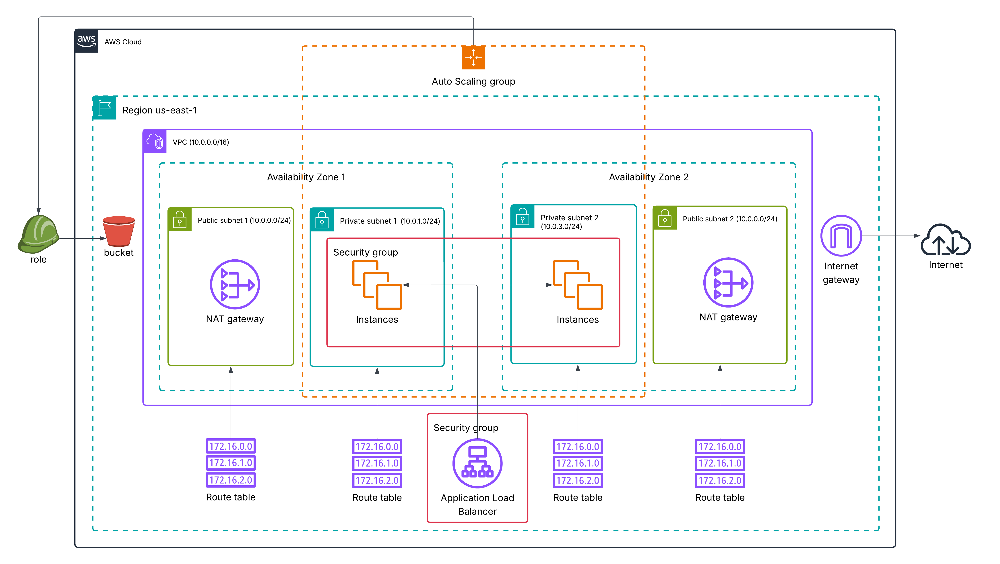
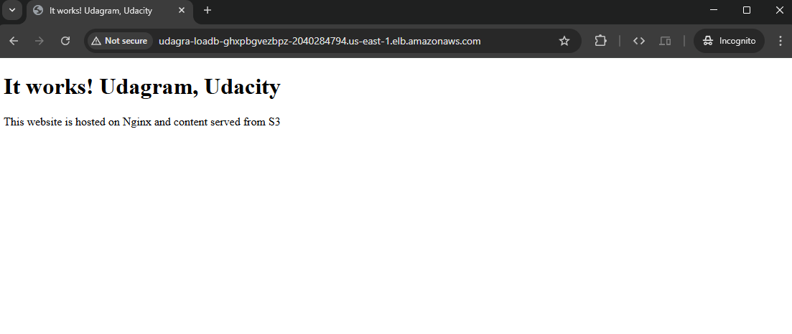

# CD12352 - Infrastructure as Code Project Solution
# Miguel Martins

## Infrastructure Diagram

## Application Load Balancer DNS name
- [http://udagra-LoadB-gHxpBgvezbPZ-2040284794.us-east-1.elb.amazonaws.com](http://udagra-LoadB-gHxpBgvezbPZ-2040284794.us-east-1.elb.amazonaws.com)

## Global Accessibility Verification
**Tested and confirmed accessible from multiple regions:**
- ✅ USA
- ✅ Australia  
- ✅ Brazil
- ✅ Iceland
- ✅ Japan

**Testing method:** VPN + incognito browser to ensure DNS propagation worldwide.

*Screenshot showing the deployed application displaying "It works! Udagram, Udacity"*

## Spin up instructions
- Use the following commands to create stacks:
    - `./create_network.sh`
    - `./create_udagram.sh`
- Use the following commands to update any of the stacks:
    - `./update_network.sh`
    - `./update_udagram.sh`

## Tear down instructions
- Run `./delete-all-stacks.sh`
- Follow the on-screen prompts to:
    - Confirm that you are connected to the correct AWS account
    - Select the stacks you wish to delete
    - Do final confirmation
- the script will:
    - Check for interdependencies between stacks
    - Confirm the deletion of selected stacks
    - Verify the removal of specific AWS resources
    - Log all actions and verification steps

## Other considerations
TODO (optional)

